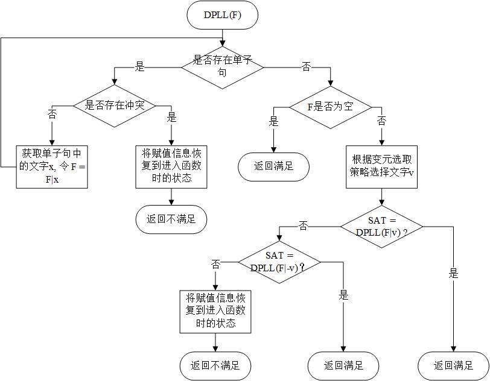

# README

## 1项目简介

这是一个基于DPLL算法的SAT问题求解器。并且利用这个求解器，实现了求解数独游戏。

在操作手册.txt中查看目标程序的使用方法。

这个项目将在下一学年程序设计课程开始之前设为private

## 2SAT问题描述

为了方便描述，首先做出如下约定：对于任一布尔变元x，“x”与其非“¬x”称为文字。对于多个布尔变元，若干个文字的或运算l1∨l2∨…∨lk称为子句。只含一个文字的子句称为单子句。不含任何文字的子句称为空子句。对给定的布尔变元集合{x1, x2, ..., xn}以及相应的子句集合{c1, c2, ..., cm}，称 c1∧c2∧...∧cm为合取范式。

SAT问题一般可描述为：给定布尔变元集合{x1, x2, ..., xn}以及相应的子句集合{c1, c2, ..., cm}，对于合取范式（CNF范式）：F = c1∧c2∧...∧cm，判定是否存在对每个布尔变元的一组真值赋值使F为真，当为真时（问题是可满足的，SAT），输出对应的变元赋值（一组解）结果。

对于合取范式F和F中的一个文字“x”，这里约定用F|x表示将文字“x”赋值为真后得到的新的合取范式。详细地说，F|x由执行以下步骤获得：

（1）移除所有包含文字“x”的子句。

（2）从所有的子句中移除文字“¬x”。

（3）将“x”于“¬x”标记为已经赋值。

实际上，如果“x”是单子句中唯一的文字，那么F|x就可以表示单子句规则。

## 3DPLL算法

我对传统的DPLL算法做出了一些优化：

（1）任何子句或文字都不会从数据中移除，而是用结构clauses_information中的数据项literals_is_true记录文字是否被赋值，用结构literals_infoamtion中的数据项is_clause_satisfied记录子句是否满足。

（2）如果同时存在两个单子句{v}和{¬v}，那么这个合取范式一定是不满足的。称一对这样的单子句为冲突单子句。发现这样的冲突后，可以退出单子句过程，返回不满足，并回溯到上一层搜索节点。

（3）设置了栈local_stack。通过将被赋值文字入栈，实现记录单子句过程中被赋值的文字。

DPLL算法流程图如图所示。



可以看到，进入DPLL函数后，如果存在单子句，则进行单子句规则。若不存在单子句，且合取范式F不为空，则开始进行分裂规则。我设计了Value算法实现F|v，设计了UnValue算法实现在回溯时将F|v撤回。

下面给出DPLL算法的伪代码描述。

```pseudocode
DPLL(){
	while(1) {//单子句传播
		if(存在冲突的单子句){
			while(local_stack不为空){
			local_stack出栈，赋值给v;
			UnValue(v); //将F从F|v后恢复
			}
			return UNSAT；
		}
		else if(存在单子句{v}){
			将v入栈local_stack;
			Value(v); //计算操作F|v
		}
		else break;
	}
	if(F为空) return SAT;
	基于某种策略选取文字v;
	Value(v);
	if(DPLL()=SAT) return SAT;
	UnValue(v);
	Value(-v);
	if(DPLL()=SAT) return SAT;
	UnValue(-v);
	while(local_stack不为空){
		local_stack出栈，赋值给v;
		UnValue(v); //将F从操作F|v后恢复
	}
	return UNSAT
}
```

2-16行描述了单子句规则：3-9行描述如果存在一对冲突单子句，则将赋值信息恢复到进入到函数时的状态。local_stack是DPLL函数的局部变量，记录其作用域内被赋值的文字。每进行一次while循环（4-7行），从栈local_stack取出文字v，然后通过算法UnValue(v)撤回此前调用Value(v)时做出的改变。10-13行描述没有冲突单子句的情况下，进行F|v操作，并将被赋值的文字v放入栈local_stack。

17-23行描述了分裂规则：17行的变元选取策略在3.2.4中给出。18-23行描述，先将文字v的值设为真，进行Value(v)，然后进行DPLL搜索。若满足，返回SAT;若不满足，先调用UnValue(v)，撤销18行调用Value(v)时做出的改变，在调用Value(-v)，将-v的值设为真。若满足，返回SAT。

24-27行与4-7行内容与作用相同，不再赘述。

### Value算法

下面给出Value算法的伪代码：

```pseudocode
Value(v){
	for(包含v的子句C){
   		将子句C标记为满足;
     	将子句C的序号存入栈changes_stack;
   	}
   	for(包含-v的子句C) {
   		将文字v设为已赋值;
    	将子句C的序号和文字-v在子句中的位置存入栈changes_stack;
    	if(C是单子句){找到C中未赋值的文字L;
    		if(-L也在单子句中){
        		将is_contradicted设为TRUE;
        		记录出现冲突的文字;
        	}
        	else{
        		将文字L放入栈unit_clause_stack;
       			将文字L标记为出现在单子句中;
       		}
    	}
    }
    depth = depth + 1;
	将文字v与-v设为已赋值;
}
```


### UnValue算法

下面给出UnValue算法的伪代码： 

```pseudocode
UnValue(V){
	depth = depth - 1;
	while(存在子句C中的文字-v已被赋值){
		将-v设为未赋值;
		if(如果C是是单子句){
		将文字L出现在单子句中的标记取消;
		}
	}
	while(存在子句C因为v被设为满足){
    将子句C标记为不满足;
    }
    将文字v与-v设为未赋值;
}
```

应当指出的是UnValue是Value的逆操作，这点在代码结构中也有体现。

### 变元选择算法

依据文字在变元中出现的次数，为变元附上不同的权值，变元选择算法将选取权值较高的文字作为返回值。为了方便描述选择过程，先约定如下的函数： 记$d_k(F,v)$表示文字v在所有长度为k的子句中出现的次数。记二元函数$Ф(x,y)=(x+1)(y+1)$。

这样，变元选择算法可以描述为：

在所有未赋值的变元中，到一个变元v，使得$Ф(d_s(F,v),d_s(F,-v))$取到最大值。其中，s是合取范式中最短子句的长度。如果$d_s(F,v)≧d_s(F,-v)$，则返回v；否则，返回-v。

算法的伪代码可以描述为：

```pseudocode
Branching(){
	s = 所有未满足子句中的最短子句的长度;
	对每一个变元v{
		x = v在所有长度为s的未满足子句中的总的出现次数;
		y = -v在所有长度为s的未满足子句中的总的出现次数;
		L = (x+1)*(y+1);
	}
	找到使L最大的变元;
	if(x>=y) return v;
	else return -v;
}
```
